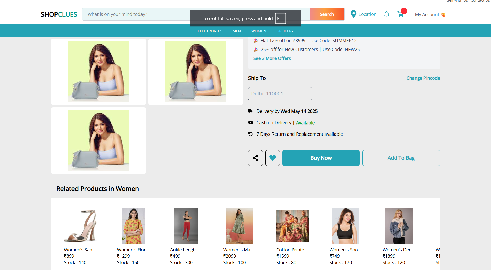

<small>


# 🛒 MERN E-Commerce Web Application

A fully functional and modern e-commerce web application built using the **MERN** stack (MongoDB, Express.js, React.js, Node.js) along with **Redux Toolkit** for state management. The application supports **JWT authentication**, **cloud storage using Cloudinary**, and is deployed with **Render** (backend) and **Firebase** (frontend).

---

## 🌐 Live Demo

> 🔗 [Frontend Live URL](https://myshopcluess.web.app)
> 🔗 [Backend API URL](https://myshopclues.onrender.com/api/v1)

---

## 📸 Project Snapshots


### Home Page 
<p align="center">
  
  

  <br>
  
  

 


### Product page
<p align="center">
    
    
</p>

<p align="center">
    
    
</p>

---

## 📦 Features

### 👨‍💼 Admin Panel *(Under Construction)*

* Admin features are currently accessible via Postman through backend API endpoints.
* Planned features include:

  * Create, update, delete product categories
  * Add, update, delete products
  * View user list and manage accounts
  * View order history and control delivery status

### 👤 User Functionality

* JWT-based secure signup/login
* Add/remove products to cart *(no quantity management yet)*
* Checkout process
* Search products with auto-suggestion
* View product details and images
* Responsive design for mobile and desktop

### 💾 Backend Features

* Built with Express.js and MongoDB
* RESTful APIs for all operations
* JWT authentication for user sessions
* Cloudinary integration for product and user images

---

## 🛠️ Tech Stack

| Tech          | Description                            |
| ------------- | -------------------------------------- |
| MongoDB       | Database for storing user/product info |
| Express.js    | Web framework for Node.js server       |
| React.js      | Frontend library for building UI       |
| Node.js       | JavaScript runtime for backend         |
| Redux Toolkit | State management for frontend          |
| Firebase      | Hosting the frontend                   |
| Render        | Hosting the backend                    |
| Cloudinary    | Image upload & management              |

---

## 🚀 Installation and Setup

### 🔧 Prerequisites

* Node.js
* MongoDB
* Firebase CLI (for frontend deployment)

### 📁 Clone the Repository

```bash
git clone https://github.com/your-username/mern-ecommerce-app.git
cd mern-ecommerce-app
```

### 📦 Install Dependencies

#### Backend

```bash
cd backend
npm install
```

#### Frontend

```bash
cd frontend
npm install
```

### 🌐 Environment Variables

#### Backend `.env`

```env
PORT=5000
MONGO_URI=your_mongo_uri
JWT_SECRET=your_jwt_secret
CLOUDINARY_CLOUD_NAME=your_cloud_name
CLOUDINARY_API_KEY=your_api_key
CLOUDINARY_API_SECRET=your_api_secret
```

### ▶️ Run Development Server

#### Backend

```bash
cd backend
npm run dev
```

#### Frontend

```bash
cd frontend
npm start
```

---

## ✉️ Contact

Created by **Anand Jha** – [anandkumarj669@gmail.com](mailto:anandkumarj669@gmail.com)
My Portfolio - [https://anandjha.netlify.app] 
Feel free to contact me for feedback, feature requests, or collaborations!

---

## 🙏 Acknowledgements

* Cloudinary for image hosting
* Render and Firebase for free tier deployments
* Redux Toolkit for clean state management

---

## 💖 Thanks

A special thanks to Almabetter for the AlmaX Training Program. This project was assigned as a part of this incredible learning journey, and it helped in implementing and reinforcing full-stack development skills through real-world application.

Thank you for exploring this E-Commerce application. Your time and interest are deeply appreciated. Every star ⭐️, fork 🍴, or contribution helps this project grow and improve. Whether you're here to learn, give feedback, or collaborate, your support means a lot!

> Keep coding, keep learning, and keep building awesome stuff! 🚀

<br></br>
##  Anand Jha 🍃🍃🍃🍃🍃🙌🙌🙌


</small>